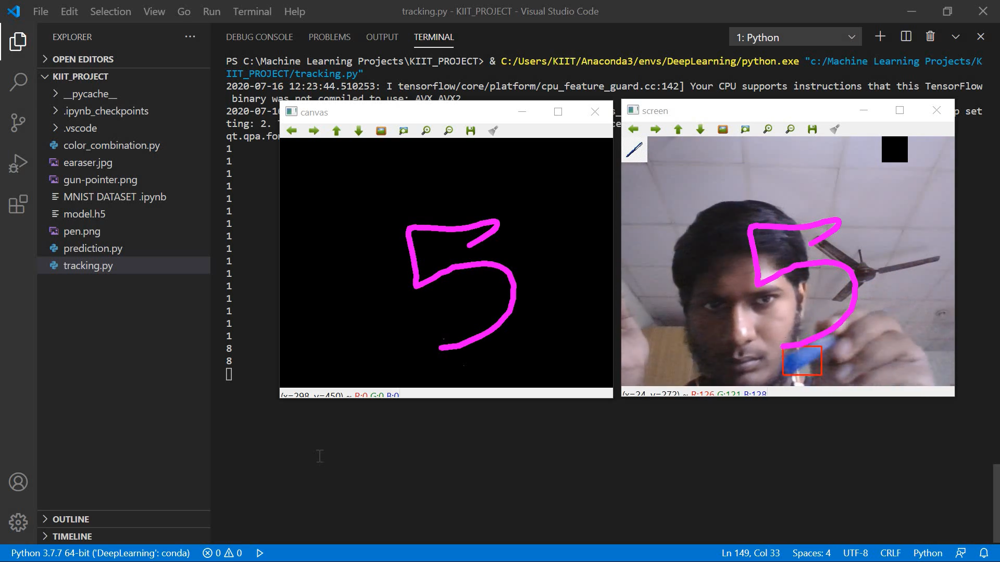
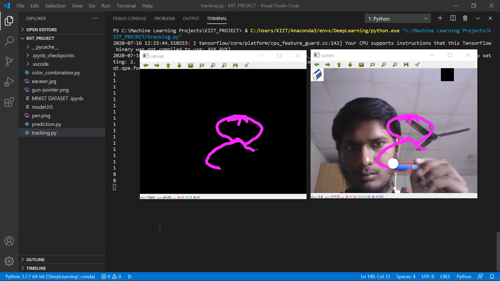
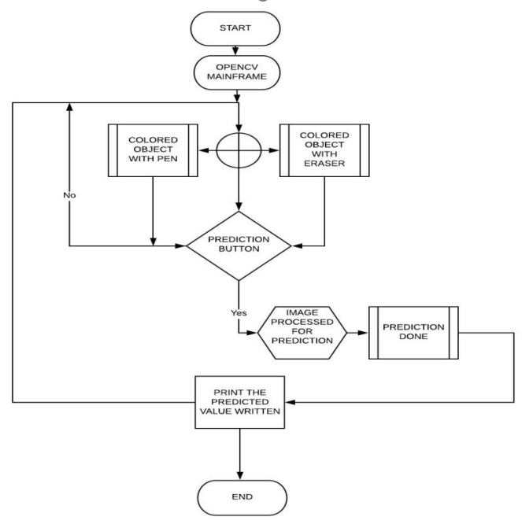

# Handwritten Digit Recognition
Hello Readers, this is a research project of <a href="https://www.linkedin.com/in/manas-chandan-behera-803590199/">mine</a> and Ritik Gupta under the guidance of <a href="https://scholar.google.com/citations?user=jl9HAJEAAAAJ&hl=en&oi=ao">Dr. B S Patro.</a>
  <strong> Project Description </strong>
<ul>
  <li>The project allows a user to write in air, as one would write in notebook which is visualised using the opencv main window.</li>
  <li>If a number is written in the air, a deep learning system is embedded in back of the system that predicts the number and prints the answer in console.</li>
  <li>This project can be very useful for specific communication.</li>
  <li>The deep learning model is prepared using the TensorFlow framework and the application is made using the OpenCV library.</li>
  <li>Look At our Project:
  <ul>
    <li></li>
    <li></li>
    <li></li>
    <li><a href="https://drive.google.com/file/d/1dEkHL9mUPh26rQap8tHP03n_gf774e4e/view?usp=sharing">Have A look At the Complete Working Project</a></li>
  </ul></li>
</ul>
